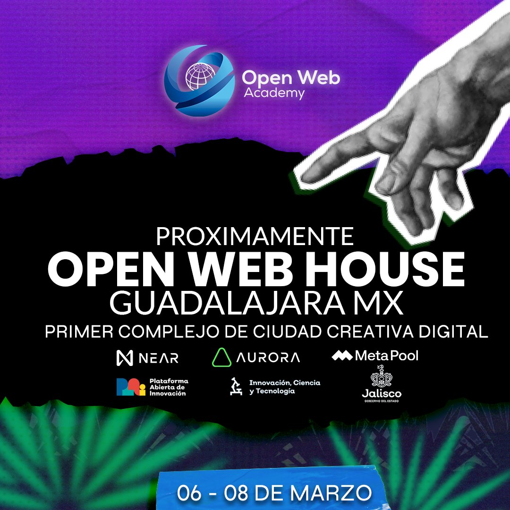

# Retos Open Web House Guadalajara 

* Evento: Open Web House Guadalajara 2023
* Fecha de publicación: 1 de marzo del 2023.
* Fecha de actualización: NA

## Retos
| # | Reto                                | Descripción                                                                                                                 | Bolsa de premios |
|---|-------------------------------------|-----------------------------------------------------------------------------------------------------------------------------|------------------|
| 1 | Construyendo valor en NEAR Protocol | Construye una aplicación decentralizada utilizando la tecnología de NEAR.  Valida su utilidad con tus usuarios objetivos.   | 1000 USDC        |
| 2 | Construyendo valor en Aurora        | Construye una aplicación decentralizada utilizando la tecnología de Aurora.  Valida su utilidad con tus usuarios objetivos. | 1000 USDC        |
| 3 | Mejor Pitch del evento              | Presenta el mejor pitch en el Open Web House.                                                                               | 500 USDC         |
| 4 | Construyendo valor con Meta Pool    | Colabora con Meta Pool en crear la siguiente generación de plataformas de staking liquido.                                  | 1000 USDC        |