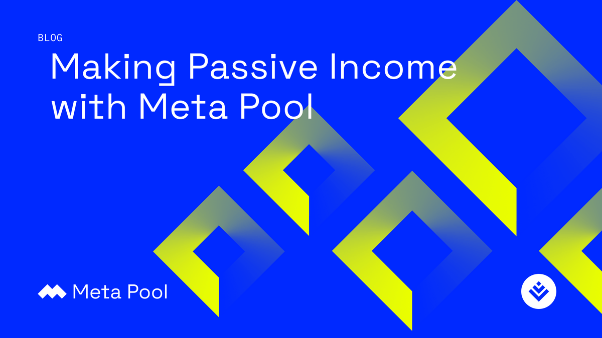
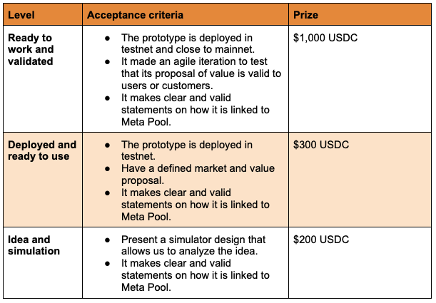

# Reto Meta Pool

* Evento: Open Web House Guadalajara 2023
* Fecha de publicación: 27 de febrero del 2023.
* Fecha de actualización: NA
  

## Introducción

Meta Pool es un proyecto de código abierto centrado en la comunidad, mantenido por un equipo central que está lanzando actualizaciones y nuevos productos al ecosistema Web 3.

Este programa busca apoyar a los participantes de Open Web House a que descubren formas innovadoras de integrar el token líquido de Meta Pool, $stNEAR, y los servicios de Meta Pool existentes dentro ecosistema NEAR y Aurora.

## Solución esperada

Cree una solución que integre el token $stNEAR, o cualquier otro servicio de Meta Pool, usándolo como una propuesta de valor.

Algunos ejemplos de soluciones de finanzas descentralizadas (DeFi) que pueden usar stNEAR son:

- Préstamos
- Intercambios descentralizados
- Monedas estables
- Activos sintéticos
- Seguros
- Otros que puedes proponer por tu cuenta.

Estas no son las únicas formas en que puede usar stNEAR, se puede proponer su propia solución sin estar relacionado con DeFi.

## Criterios de evaluación y premios

El puntaje asignado por el equipo de Meta Pool a las soluciones presentas durante el evento se evaluarán utilizando el siguiente marco:

- Bolsa máxima de premios: 1000 USDC
- Esquema de pago: 3 a 5 días posterior al evento
- En caso de que las propuestas no alcancen el criterio mínimo de aceptación, el reto se declarará sin ganadores.

## Ideas sugeridas

Si no sabes por donde empezar estas ideas fueran generadas y sugeridas por el equipo de Meta Pool.

- **Aplicación móvil para rastrear activos:** una aplicación que está disponible en PlayStore e iOs que hace un seguimiento claro de los activos de Meta Pool y su valor en el tiempo.
- **DCA de stNEAR:** Cambie una cantidad fija de USDC a stNEAR todos los meses durante 1 año para cuidar el saldo de su cartera.
- **Aprendizaje gamificado para Liquid Staking:** Otorga recompensas e insignias mientras aprendes sobre liquid staking y DeFi.
- **Recetas DeFi de $stNEAR:** Una interfaz de usuario simple para mostrar las opciones de dónde usar $stNEAR en el ecosistema DeFi (Préstamo, intercambio, farmeo y proporcionar liquidez).
- Meta Tamagotchi: Compra tu Meta-Gotchi (NFT) con $stNEAR. Haz que baile, juegue o alimente con tokens $META.
- **Meta Tanda:** Un grupo de personas inicia su tenencia de tokens con base en las contribuciones periodicas de la comunidad.
- **Baúl de ahorros en stNEAR:** Ahorre $stNEAR diariamente y gane más $META en recompensas
- **NEAR Social <> Meta Yield:** Comparta las últimas actualizaciones de su campaña de Meta Yield en un widget de near.social.
- **Sistema de notificación para los servicios de Meta Pool:** Notifique a los usuarios sobre actualizaciones en sus contratos inteligentes.
- **Recompensas en stable coins:** Bóveda que paga las recompensas obtenidos en stNEAR por stable coins. (mensualmente o en un período de tiempo predefinido)
- **Bóvedas de DeFi protegidas por tokens:** El usuario deposita $stNEAR durante 3, 6, 9, 12 meses y las recompensas de participación se utilizan para invertir en otras plataformas de DeFi para aumentar el rendimiento (Pembrock, SpinFi, otro)

## Preguntas frequentes

* **¿Qué es Meta Pool?** Es una solución de staking líquido que permite a los usuarios tener un activo compuesto ($stNEAR) que representa tanto: el stake y sus recompensas.
* **¿Qué quiere Meta Pool que sea desarrollado?** Un prototipo funcional en TestNet o MainNet con un mercado o grupo de usuarios validado.
* **¿Cómo debería funcionar?** Utilizando un servicio de Meta Pool como el token de $stNEAR y/o $META en una o ambas redes: Aurora o NEAR Protocol; Meta Bond, Meta Vote, Meta Staking Vote o cualquier otro que beneficie directamente a los usuarios de Meta Pool.
* **¿Se puede desarrollar la solución en la red Aurora (Solidity)?** Sí, se puede desarrollar para Near o Aurora Network. Pregunte si está proponiendo el uso de otras redes blockchain.
* **¿La solución debe estar en Mainnet o Testnet?** Le recomendamos que se lance en Mainnet, ahora o más tarde. Sin embargo, dado a que el tiempo del Open Web House es limitado, esperamos que por lo menos se logre en testnet.
* **¿La solución propuesta debe ser una solución de finanzas descentralizadas (DEFI)?** No es obligatorio. Puede proponer un proyecto que correctamente no sea una solución defi.
* **¡Gané esta recompensa! ¿Qué sigue?** ¡Felicitaciones! El equipo de Meta Pool se pondrá en contacto con usted para pagar su premio. Dependiendo de lo que proponga su solución, el equipo de Meta Pool buscará una colaboración.

## Inelegibilidad de proyectos
Proyectos en los que no estamos interesados en apoyar:

- Iniciativas que están relacionadas con juegos de azar.
- Proyectos que solo utilizan stNEAR como método de pago, sin darle utilidad.

## Descargo de responsabilidad
El contrato inteligente de Meta Pool ha sido auditado por Blocksec.
Meta Pool se reserva el derecho de cerrar el Programa Open Web House Bounty en cualquier momento sin previo aviso. Sin embargo, tenga en cuenta que se respetarán los pagos acordadas bilateralmente antes de eso.

  

# Anexo técnico 
## Que es stNEAR?
Stnear Token es una colateral que representa tus tokens más las recompensas de Staking en NEAR.

Nombre: Staked NEAR
Ticker: stNEAR
Standard: NEP-141
Suministro máximo: Indefinido.
Rainbow bridge: Sí.
Smart contract address for mainnet: meta-pool.near 
Smart contract address for testnet: meta-v2.pool.testnet
Smart contract address for Aurora: 0x07f9f7f963c5cd2bbffd30ccfb964be114332e30
Smart contract address for Aurora (testnet): 0x2137df2e54abd6bF1c1a8c1739f2EA6A8C15F144

## Cómo integrar stNEAR en tu proyecto.
stNEAR se puede usar en la capa-1 de NEAR Protocol o en la red Aurora (EVM), una máquina virtual Ethereum de capa 2 que se trabaja sobre NEAR Protocol.

Teniendo esto en cuenta, puede desarrollar una solución para la capa 1 utilizando usando RUST o Javascript, o puede usar Solidity en la red Aurora para desarrollar una solución.

Esta es la documentación que sugerimos que usted y su equipo deben leer para aprender sobre NEAR Protocol, Meta Pool, tokens fungibles y stNEAR:

* NEAR Docs: https://docs.near.org/docs/develop/basics/getting-started
* NEAR 101: https://www.youtube.com/watch?v=m6LJUpPPHoE
* Fungible Token | NEAR Protocol https://nomicon.io/Standards/Tokens/FungibleToken/Core
* Meta Pool Gitbook https://metapool.gitbook.io/master/tutorials-1/meta-pool-on-near
* Meta Pool GitHub https://github.com/Narwallets/meta-pool / https://github.com/Meta-Pool

Quieres más soporte? unete al discord
- Discord: https://discord.gg/qHC9KnJXHM

## Proyectos usando stNEAR

NEAR Protocol
- Meta Pool: metapool.app
- Meta Yield: metayield.app
- Ref Finance: ref.finance
- Burrow Cash: app.burrow.cash
- Jumbo Exchange: jumbo.exchange
-Octopus Network: oct.network

Aurora Network
- Trisolaris: trisolaris.io
- WannaSwap: wannaswap.finance
- Polaris Finance: polarisfinance.io
- Bastion: bastionprotocol.com/ 
- Aurigami: aurigami.finance/ 

Puedes encontrar más información el gitbook de Meta Pool: https://metapool.gitbook.io/master/

