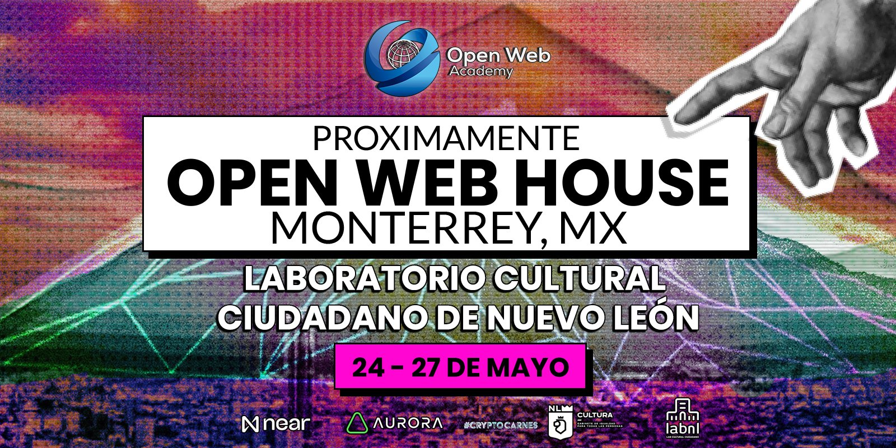

# Retos Open Web House Monterrey 2023

* Evento: Open Web House Monterrey 2023
* Fecha de publicación: 15 de mayo del 2023.
* Fecha de actualización: NA

## Retos
| # | Reto                                | Descripción                                                                                                                 | Bolsa de premios |
|---|-------------------------------------|-----------------------------------------------------------------------------------------------------------------------------|------------------|
| 1 | BOS is multichain | Construye un gateway que te permita tener un blockchain descentralizado para cualquier cadena   | 600 USDC        |
| 2 | Comunidad primero             | Haz crecer hasta la luna la comunidad de tu proyecto.                                                                               | 200 USDC         |
| 3 |    EVM is BOS     | Construye un widget para una aplicación corriendo dentro de un EVM en BOS | 750 USDC        |
| 4 | Mejor Pitch del evento              | Presenta el mejor pitch en el Open Web House.                                                                               | 200 USDC         |
| 5 | Construyendo valor con Meta Pool    | Colabora con Meta Pool en crear la siguiente generación de plataformas de staking liquido.                                  | 500 USDC        |
| 6 |    NEAR is BOS     | Construye un widget para una aplicación corriendo dentro de NEAR Protocol | 750 USDC        |
| 7 |    Pide tu merch    | Unete a las comunidades de NEAR y Open Web Academy y recibe Merch del evento | N/A       |
| - | -  | Total                                 | 3000 USDC        |