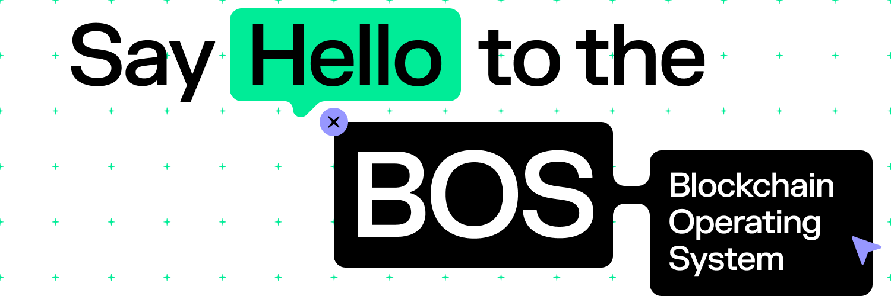

# Reto Blockchain Operating System (BOS) is multichain

* Evento: Open Web House Guadalajara 2023
* Fecha de publicación: 1 de marzo del 2023.
* Fecha de actualización: NA
  

## Introducción

_Blockchain Operating System_ es una de las maneras más sencillas de construir y desplegar un frontend descentralizado que sea util para cualquier cadena: NEAR, Ethereum Virtual Machines, Solana, Polkadot, etcetera. Además de eso, toda la información vive dentro del blockchain de NEAR Protocol, haciendo tu frontend totalmente descentralizado.

Blockchain Operating System tiene como objetivo abordar varios desafíos críticos relacionados con la creación de interfaces para aplicaciones Web 3.0, incluidos el acceso, la seguridad, la composición y la agilidad. Con BOS, los usuarios siempre tienen la capacidad de ejecutar localmente aplicaciones de cadena de bloques, lo que ayuda a garantizar la solidez y la resistencia a la censura, al tiempo que mantiene una experiencia fácil de usar.

Los Gateway de Blockchain Operating System hacen que los front-end descentralizados y administrados localmente estén disponibles para las masas. Un gateway consta de una máquina virtual especialmente diseñada que carga y ejecuta interfaces para protocolos creados en Ethereum, L2 y otras capas 1 como NEAR. El código de estas interfaces se almacena en la cadena de bloques NEAR.

Cada gateway se especializa en ofrecer a los usuarios experiencias las cuales pueden interactuar con diferentes blockchains y hagan más sencilla la interacción de los usuarios mediante el despliegue de diferentes aplicaciones Web 3.0, todo en un mismo lugar. Actualmente existe el despliegue de diferentes gateways que buscan ofrecer soluciones diferentes a los usuarios, como por ejemplo un ecosistema de desarrollo con BOS, un gateway compatible para el desarrollo de interfaces que interactúan con EVMs, entre otras.

## Solución esperada

Realizar la integración de una nueva blockchain, que no sea un EVM, con un gateway de Blockchain Operating System. Como por ejemplo: 

- Solana
- Polkadot
- Bitcoin, ordinals o stamps.
- Otra blockchain.

Y desarrolla por lo menos 1 widget para comprobar la interacción con la blockchain.

## Criterios de evaluación y premios

El puntaje asignado por el equipo de Aurora Latam a las soluciones presentadas durante el evento se evaluarán utilizando el siguiente marco:

| Nivel                        | Criterios de aceptación                                                                                                                                                                                        | Premio    |
|------------------------------|----------------------------------------------------------------------------------------------------------------------------------------------------------------------------------------------------------------|-----------|
| Listo para usarse y validado | * Prototipo desplegado en un sitio y listo para ser usado * Se hizo una iteración para probar su propuesta de valor ante los usuarios. * Hace uso de la interacción alguna blockchain (Excepto: NEAR, Ethereum, EVMs) en su infraestructura para construir su propuesta de valor. | 600 USDC |
| Desplegado de manera local        | * Tiene un mercado y propuesta de valor definido. * Hace uso de la interacción con alguna blockchain (Excepto: NEAR, Ethereum, EVMs) en su infraestructura para construir su propuesta de valor.                                               | 300 USDC  |
| Idea y simulación            | *Presenta un simulador (mockup o diseño de UI) que ayude a valorar la idea. * Hace uso de la interacción con alguna blockchain (Excepto: NEAR, Ethereum, EVMs) en su infraestructura para construir su propuesta de valor.                                                     | 100 USDC  |                                             | 100 USDC  |

- Bolsa máxima de premios: 800 USDC
- Esquema de pago: 10-15 días posterior al evento
- En caso de que las propuestas no alcancen el criterio mínimo de aceptación, el reto se declarará sin ganadores.
- Es necesario que tu proyecto esté registrado en NEAR Horizon para participar: https://near.org

## Preguntas frequentes
- ¿Qué es Blockchain Operating System?
Blockchain Operating System (también conocido como BOS), es un protocolo basado en blockchain para crear e implementar front-end descentralizados. BOS tiene como objetivo revolucionar la forma en que desarrollamos e interactuamos con aplicaciones descentralizadas.

- ¿Por qué usar BOS?
BOS tiene como objetivo abordar varios desafíos críticos relacionados con la creación de interfaces para aplicaciones Web 3.0, incluidos el acceso, la seguridad, la composición y la agilidad. Con BOS, los usuarios siempre tienen la capacidad de ejecutar localmente aplicaciones de cadena de bloques, lo que ayuda a garantizar la solidez y la resistencia a la censura, al tiempo que mantiene una experiencia fácil de usar. El código de los componentes siempre está en cadena, lo que lo hace auditable y visible en los exploradores. Esto mejora la seguridad y los usuarios pueden ejecutar localmente BOS completa con confianza. Además, BOS fomenta la componibilidad al permitir a los desarrolladores reutilizar y mezclar componentes.

- ¿Qué Blockchains soporta actualmente BOS?
Soporta cualquier EVM y NEAR Protocol

- ¿Cuanto es el fee por subir mi código a BOS?
El código fuente de las aplicaciones (frontend) está en NEAR, debido a su capacidad para almacenar HTML/CSS/JS de manera muy económica (unos pocos centavos de dolar).

## Inelegibilidad de proyectos
Proyectos en los que no estamos interesados en apoyar:
- Proyectos que NO hagan uso de Blockchain Operating System.
- Proyectos que NO agreguen una Blockchain diferente a las que actualmente soporta BOS

# Anexo técnico

¿Dónde puedo aprender acerca de Blockchain Operating System?
- Sitio oficial NEAR: https://near.org/
- NEAR Docs: https://docs.near.org/bos
- Ejemplos de widgets en BOS: https://docs.near.org/bos/tutorial/interaction
- Desplegando un gateway de BOS: https://docs.near.org/bos/tutorial/bos-gateway
- OWA Live: Explorando Blockchain Operating System + demo: https://www.youtube.com/watch?v=z4njqVv_aV4
- OWA Live: - Conociendo NEAR Protocol: https://www.youtube.com/watch?v=m_BdC7GRtAo
- NEAR 101: https://www.youtube.com/watch?v=m6LJUpPPHoE
- Lanzando aplicaciones con el SDK de Javascript | NEAR Protocol: https://www.youtube.com/watch?v=eu4tWcEJOnE
- Herramientas de Desarrollo en NEAR Protocol: https://www.youtube.com/watch?v=_NH5mr5QkAQ
- Wiki: https://wiki.near.org/overview/getting-started

Gateways desplegados de BOS + Repositorio en Github
- NEAR: https://near.org/
- NEARPad: https://nearpad.dev/
- BOS.gg (Gateway para EVM's): https://bos.gg/
- Cantopia: https://bos-viewer.pages.dev/
- NEAR Genadrop: https://near.genadrop.io/
- Conoce más proyectos aquí: https://near.org/gateways
- Repositorio de Github de BOS: https://github.com/NearSocial/VM
