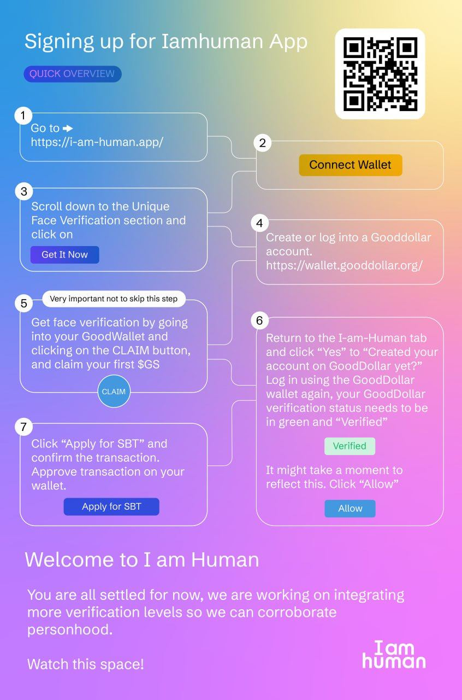

# Pide tu merch del Open 

* Evento: Open Web House Monterrey 2023
* Fecha de publicación: 15 de mayo del 2023.
* Fecha de actualización: NA
  

## Introducción

Tenemos varios regalos para ti por haber asistido al Open Web House, muchos de ellos en ediciones únicos que no se volverán a imprimir en otros eventos. Aquí podrás saber como reclamarlos.

## Pasos a completar para 

- Crea una cuenta de NEAR Protocol. Pide tú codigo QR en el evento para crear una.
- Unete al Discord de Open Web Academy. Postea una foto #🏠-ow-house de que estás en el evento: http://discord.gg/XhGJXszkyc
- Crea tu perfil de NEAR Social. Postea una foto de que como te la estás pasando en el Open Web House: http://near.social
- Verifica tu cuenta de NEAR Protocol en I-am-human. Te permitirá votar en el NEAR Digital Collective: http://i-am-human.app.
 

## ¿Cómo verificar tu cuenta de I-am-human?

Este servicio emitirá un Soul Bound Token (SBT) una vez que hayas verificado tu información. Aquí una infografía al respecto:

## Preguntas frequentes

* **¿Puedo usar otras redes sociales?** Sí, solo indica cuales serán usadas. 
* **¿El meetup tiene que ser virtual o presencial?** Cualquiera que tu elijas. 
* **¿El meetup tiene que ser en las fechas del Open Web House?** No, se puede realizar de manera posterior. Lo que se tiene que entregar es la fecha y publicidad del evento (Eventbrite, post, etc).

